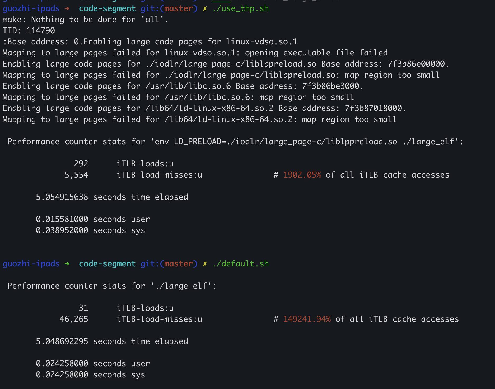

This project demostrates how to use iodlr to map the code segment into huge page, and shows the effect to iTLB miss.

## Run

1. Enable THP by running enable.sh, make sure the content of /sys/kernel/mm/transparent\_hugepage/enabled is madvise or always
2. Compile large\_elf.cpp by running compile.sh
3. Open a new terminal pane and run watch.sh to look at huge page usage.
4. Run default.sh to show perf result when not using huge page.
5. Run use\_thp.sh to show perf result when using huge page.

## Result

## Discussion

1. Can use explicit huge page too, please refer to https://easyperf.net/blog/2022/09/01/Utilizing-Huge-Pages-For-Code
